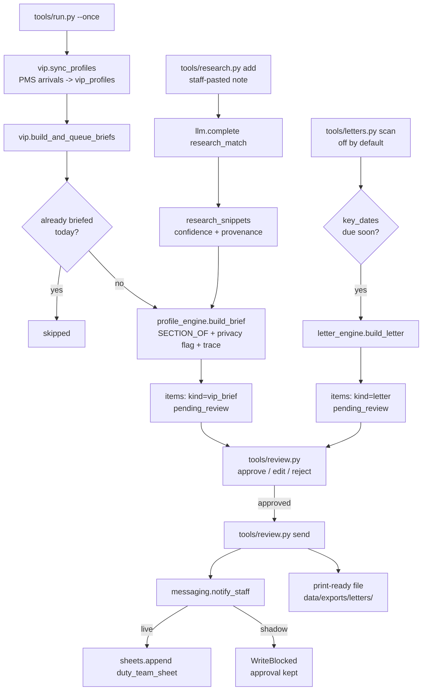

# VIP AI — "The Insider"

One system that makes every VIP feel known.

## What it does

**Does.** One system that makes every VIP feel known. Before arrival it researches the guest from public sources (LinkedIn first, then Instagram and press). It keeps a living profile of every VIP — preferences, history, key dates — that grows with every stay. And each morning it sends staff a short brief on the VIPs in-house: who they are, what they like, and the small detail that makes service feel personal, like asking how last night's dinner in town was.

## What it won't do

Uses only public information and what guests share; respects privacy and data rules (pairs with the Compliance AI). Won't invent details — if it isn't sure about a match, it says so.

## Why it matters

Personalisation needs memory. Research, memory, and daily staff briefs are really one job — split across three tools, the small things fall through the cracks. Together, staff always know what turns a guest into a regular.

## What to expect

Every VIP researched, remembered, and briefed to the right staff before check-in — a compounding memory of your best guests.

**ROI:** +25% — VIP repeat rate (guest).

> Two things this template is honest about up front: **it does not scrape
> LinkedIn, Instagram or the press** (the roster's headline research promise
> is real staff work this repo helps structure, not an automated crawler —
> see `docs/how-it-works.md`, "Design decisions" #1), and **it does not call
> a handwriting robot** (the Scribe's letters end as a print-ready file, not
> a physical mailing — decision #13). Neither gap was introduced here; both
> are real gaps in the demo this repo is built from.

## Who it's for

Independent hotels and small groups with a handful of returning guests worth
knowing by name, and at least one person who reads a morning brief before
service starts. It replaces the mental list a longtime GM or duty manager
keeps in their head — the one that disappears the day they leave — with a
profile that survives staff turnover and a brief that reaches whoever is on
duty, not just whoever remembers. It does not replace the judgement of
someone talking to the guest in person; every brief and every letter waits
for a human before it goes anywhere.

Works for a restaurant too: "the wine they always order, the table they
like, the anniversary" instead of a hotel stay — "arrival" becomes "tonight's
book" and "stays" becomes "visits". Ask your Claude session to walk through
re-pointing `config/agent.yaml`'s `sections:` map for a floor/kitchen split
instead of housekeeping/F&B/front office if you're adapting this for a
restaurant.

## How it works



**Modes.** `mode: shadow` (default, in `config/hotel.yaml`) — the agent
reads, decides, drafts, and queues. Nothing is ever sent and nothing is ever
written to your PMS — shadow blocks every send, even one you have already
approved. `mode: live` lets an approved item actually go out; nothing
unapproved ever does, live or not. Full detail in `docs/safety.md`.

**The review loop.** Every draft — a VIP brief, a letter — waits in the same
queue (`python3 tools/review.py list`). A human approves, edits, or rejects;
only then can anything leave the building. `workflows/80-review.md`.

**What runs when:**

| Job | Cadence | Command |
|---|---|---|
| Sync profiles + build briefs | every morning | `python3 tools/run.py --once` |
| Handwritten letter scan | every morning, after briefs | `python3 tools/letters.py scan` (off by default) |
| Research intake | on demand | `python3 tools/research.py add` |

**Sub-agents.** **Handwritten Letter AI** ships in this repo and is **off by
default** — see "Sub-agents in this repo" below and `docs/sub-agents.md` for
why: VIP AI's own promise stands on its own without it.

Full mechanics, every design decision, and the fixes to the source's own
defects: `docs/how-it-works.md`.

## What you need

To run the demo below: nothing but Python 3.11+. To run it for real:

- **A way to read your arrivals book** — an export you can turn into CSV
  (`systems.pms.adapter: csv`, works with any PMS, no API access needed), or
  API credentials for a `built` adapter (`cloudbeds` today). VIP AI also
  writes one thing back: a preference note, via `pms.add_note`.
- **A channel the duty team actually reads** — `systems.messaging.adapter:
  unipile` (your own WhatsApp) or `webhook` (relay into whatever your
  "morning huddle" tool already is). This is where an approved brief goes.
- **Staff willing to paste in what they find.** There is no scraper here —
  see "What it won't do" above. `tools/research.py add` is only as useful as
  what someone puts into it.
- **A way to think** — `llm.provider: interactive` needs only the Claude
  Code session you already have open; `claude-code` and `anthropic` are
  covered in `docs/safety.md`. This matters less here than in most of the
  family: the only LLM call in the whole repo is the research-intake helper,
  and it never runs on a schedule.

Time to get running for real: about 20 minutes once you have a CSV export or
API credentials in hand.

## Quick start (5 minutes, no credentials)

```bash
git clone https://github.com/th1-ai/vip-ai.git vip-ai && cd vip-ai
make setup
make demo
```

Expect to see something like:

```
VIP AI demo - arrivals book as of 2026-09-10 from fixtures/hotel/reservations.json

Synced 4 VIP arrival(s) from the PMS, 0 skipped (no email/phone/name to key on).

  research research-note-01 (eleanor.ashby@example.com): confirmed
    Wine columnist feature, FT Weekend, June 2026
  research research-note-02 (priya.kapoor@example.com): unsure - needs a human look
    Possible design-conference speaker match
  research research-note-03 (marco.bellini@example.com): likely - needs a human look
    Personal details inferred from a social post
  research research-note-04 (sam.whitfield@example.com): likely
    Publishing professional, LinkedIn

Built 4 brief(s): 1 flagged for a privacy check before anyone sees them, 0 already briefed today.

  pending_review Sam Whitfield          Sam Whitfield — Silver, 1 stays, arriving Sat 12 Sep (D+2). Worth thirty seconds of your morning. If the conversation allows: publishing professional, linkedin (r-research-note-04).
  pending_review Eleanor Ashby          Eleanor Ashby — Platinum, 11 stays, arriving Sat 12 Sep (D+2). Worth thirty seconds of your morning. If the conversation allows: wine columnist feature, ft weekend, june 2026 (r-research-note-01).
  pending_review Marco Bellini          Marco Bellini — Gold, 4 stays, arriving tomorrow. Worth thirty seconds of your morning. No research angle on file — keep it warm and short.
  needs_human    Priya Kapoor           Priya Kapoor — Gold, 5 stays, arriving today. Greet by name in the suite, never across the lobby. No research angle on file — keep it warm and short.

Handwritten Letter AI is off by default (subagents.handwritten_letter.enabled: false). Flip it to true in config/agent.example.yaml and re-run `make demo` to see it draft a letter.

Nothing was sent: mode is shadow, and demo never calls `tools/review.py send`.
Next: `make review` to see what is waiting, or read workflows/10-vip-brief.md.

DEMO OK — 4 items processed, 4 drafted, 0 sent (shadow)
```

Then `make doctor` — expect one `FAIL` (`hotel identity`, because the
property is still the shipped placeholder "Hotel Aurora") and a few `warn`
lines, including "Handwritten Letter AI is off (the default)". That is the
intended state of a fresh clone; see `workflows/00-setup.md`.

Want to see the Scribe run too? Set
`subagents.handwritten_letter.enabled: true` in `config/agent.example.yaml`
and run `make demo` again — `tools/demo.py` always reads
`config/hotel.example.yaml` and `config/agent.example.yaml`, never your own
`config/agent.yaml`, so this is safe to try and easy to undo.

## Set up with Claude Code

Open `claude` in this folder. Paste each prompt below when you reach it —
each one names the workflow file Claude will follow.

**Phase 1 — get it running.**

> Read `workflows/00-setup.md` and walk me through it. Ask me for the
> property details, my tier thresholds, and which systems I want to connect
> first.

**Phase 2 — the first real pass.**

> Read `workflows/10-vip-brief.md`. Run a real pass, show me who got a
> brief, and help me log a research note for one of them.

**Phase 3 — the review queue.**

> Read `workflows/80-review.md`. Show me what's waiting, read the first
> brief to me in plain language, and walk me through approving or editing
> it.

**Phase 4 — the Scribe, if you want it.**

> Read `docs/sub-agents.md` and `workflows/20-handwritten-letter.md`. Should
> I turn Handwritten Letter AI on? Walk me through it either way.

**Phase 5 — go live.**

> Read `workflows/90-go-live.md`. Check the checklist against where I
> actually am, and only raise going live if it's genuinely met.

## Connect your systems

Full detail, including the "implement your own" recipe, is in
`docs/integrations.md`. This agent uses three of the four shared adapters —
**PMS**, **Messaging**, and **Sheets**. It does not use Email at all: no
brief or letter is ever sent to a guest's inbox.

### PMS — `systems.pms.adapter` in `config/hotel.yaml`

| Adapter | Status | Needs | Notes |
|---|---|---|---|
| `mock` | universal | nothing | Reads `fixtures/hotel/*.json`. What `make demo` uses. |
| `csv` | universal | a CSV export | Reads `data/imports/*.csv`. **Start here.** Works with every PMS. |
| `cloudbeds` | built | OAuth app + refresh token | Live reads and writes. |
| `cli` | universal | a JSON-speaking CLI | Advanced. Bridges to a vendor command line tool. |

### Messaging — `systems.messaging.adapter` in `config/hotel.yaml`

| Adapter | Status | Needs | Notes |
|---|---|---|---|
| `mock` | universal | nothing | Logs to memory. What `make demo` uses. |
| `unipile` | built | your own UniPile account | A WhatsApp broadcast to the duty team, on your own number. |
| `webhook` | universal | any URL | POST to Zapier, Make, n8n, or your own "morning huddle" tool. |

### Sheets — `systems.sheets.adapter` in `config/hotel.yaml`

| Adapter | Status | Needs | Notes |
|---|---|---|---|
| `csv` | universal | nothing | Writes `data/exports/vip_briefs.csv` (or whatever `review_notify.duty_team_sheet` names). |
| `google` | built | service account JSON | A live shared spreadsheet — the honest stand-in for "the housekeeping app". |

### Everything else

`pos`, `accounting`, `reviews`, `calendar`, `payments`, `procurement` and
`locks` are unused stubs, same as every repo in this family. `courier` gets
one real call — a postal letter's shipment record — and is expected to raise
`AdapterNotImplemented`; see `docs/integrations.md`. `email` is a fully
built adapter family in `core/`, simply not used by this agent.

Check what is actually working on your machine at any time: `make doctor`.

## Run it

```bash
make run                            # sync profiles + build briefs + scan letters
make run ARGS="--only briefs"       # just the sync + brief pass
make run ARGS="--only letters"      # just the letter scan
make run ARGS="--dry-run"           # compute nothing new, write nothing
make watch                          # loop on the configured interval
make schedule                       # print a snippet for the first schedule: job
make schedule ARGS="--all"          # one snippet per job in config/agent.yaml's schedule:
```

`config/agent.yaml`'s `schedule:` block lists both real jobs — `main`
(sync + briefs) and `letters_scan` — each with its own `command:` and
`cadence:`; `make schedule ARGS="--all"` prints one ready-to-paste cron (or
`--target launchd` / `--target systemd`) snippet per job, with the absolute
paths for this machine already filled in. See `scheduler/` for the
cron/launchd/systemd examples and how to install one.

`workflows/10-vip-brief.md` covers the main loop in full;
`workflows/20-handwritten-letter.md` covers the Scribe's own commands
(`scan`, `dispatch`). `workflows/80-review.md` covers the queue.

**Subscription or API.** `llm.provider: interactive` or `claude-code` uses
the Claude Code subscription you already pay for; `anthropic` uses your own
API key for volume. This matters less here than elsewhere in the family —
see "What you need" above — but the honest note still applies: automated use
of a personal subscription is subject to Anthropic's usage policy and rate
limits. `tools/research.py` never runs on a schedule, so there is no steady
background load either way.

## Go live

`mode: shadow` (the default) means nothing is ever sent and nothing is ever
written to your PMS — shadow is a global kill switch that blocks every send,
even one you have already approved. Going live means an **approved** brief
or letter actually goes out the next time someone (or a scheduled job) runs
the relevant command — never anything unapproved, live mode or not. The
checklist, and exactly how to flip it (and flip it back), is
`workflows/90-go-live.md`.

## Guardrails & safety

- **No scraper.** This repo never calls LinkedIn, Instagram, a search engine
  or any other external service. `tools/research.py` structures a note a
  human already found — see `docs/how-it-works.md` decision #1.
- **An uncertain or guardrail-flagged research note is excluded, not
  dropped.** `confidence: unsure`, or any note read as inferring health,
  family or money, is stored but never appears on a brief until a human runs
  `tools/research.py confirm <id>`.
- **Every brief line is traced.** A preference key, a research id, or
  "profile" — nothing in a brief is invented; it cannot be, structurally.
- **A privacy flag changes tone, not content.** `private`, `discreet`,
  `never post` or `no publicity` anywhere in a profile routes the brief to
  `needs_human` and adds an explicit in-person-only line.
- **The living profile only grows through `tools/vip.py capture`** — a sync
  never overwrites what a human taught the agent, and it seeds preferences
  from the PMS once, at profile creation, never again.
- **Every letter needs a human, no threshold.** High-value guest or not,
  every letter goes `pending_review` before anyone can dispatch it.
- **No robot writes anything.** A letter's dispatch is a print-ready file;
  no pen-plotter API is called anywhere in this build.
- **`do_not_contact` suppresses letters, never briefs.**
- **AI disclosure.** VIP AI's output is internal (staff briefs, a print-ready
  letter file) — the guest-facing letter text itself should still carry a
  line making clear a human wrote and approved it; see `docs/safety.md`.

Full detail, the GDPR summary, and the subscription-vs-API note in full:
`docs/safety.md`.

## Sub-agents in this repo

VIP AI's own promise stands on its own. **Handwritten Letter AI** is folded
into this repo but ships **off by default** — a physical letter is a real
cost, not a free extra. See `docs/sub-agents.md`.

### Handwritten Letter AI — "The Scribe"

**Does.** Sends real handwritten letters (via a robotic-handwriting service) to VIPs for birthdays, anniversaries, and the milestones it tracks, to deepen long-term relationships.

**Won't.** Drafts the message for approval on high-value relationships, and works from the key dates the VIP AI tracks.

**Why.** A handwritten note cuts through where another email never will. It's how you turn a guest into a regular.

**Output.** Turns key VIP dates into a personal touch that drives repeat stays and loyalty.

This template's version tracks key dates you add with `tools/vip.py
key-date`, drafts from the preference card, needs a human for every letter
with no exceptions, and dispatches to a print-ready file — **no
handwriting-robot API is called anywhere in this build**, honestly, see
`docs/how-it-works.md` decision #13. Runs as `tools/letters.py`. Workflow:
`workflows/20-handwritten-letter.md`.

```yaml
subagents:
  handwritten_letter:
    enabled: true   # VIP AI keeps briefing on its own either way
```

## Customising

- **Tier thresholds.** `config/agent.yaml`'s `tiers:` —
  `platinum_min_stays` / `gold_min_stays`. Silver is everyone else, and
  `rules.vip_first` deliberately does not prioritise Silver.
- **Desk routing.** `config/agent.yaml`'s `sections:` — extend the default
  preference-key-to-desk map if your property tracks something the defaults
  miss; unmapped keys land in `front_office` (`docs/how-it-works.md`
  decision #8).
- **Where a brief goes.** `review_notify.duty_team_sheet` — the sheet name
  used by the follow-on export after `messaging.notify_staff` succeeds.
- **The brief and letter text.** Both are deliberately LLM-free — the logic
  lives in `tools/profile_engine.py` and `tools/letter_engine.py` as plain
  Python functions. Ask your Claude session to change the wording; the
  traceability guarantee around *what* can appear doesn't move.
- **The research prompt.** `prompts/research_match.md` is plain markdown —
  edit it directly, no code involved.
- **A language other than English.** `core/i18n.py` ships with the family;
  this agent's output is staff-facing (a brief, a letter) rather than a
  guest reply, so language detection is not wired in here by default — ask
  your Claude session if your duty team needs briefs in more than one
  language.

## Troubleshooting & FAQ

**Q: Why didn't a guest get a brief?**
Run the sync directly and check the profile:
`python3 tools/run.py --once --only briefs` then
`python3 tools/vip.py show <guest email>`. Common causes: outside
`brief.lookahead_days`, no email/phone/name to key the profile on, or
already briefed today.

**Q: A research note keeps coming back `needs_human` — is that a bug?**
Usually not — see `docs/safety.md`. It means the note reads as uncertain, or
as inferring something the public-sources guardrail excludes.
`tools/research.py confirm <id>` is the human override.

**Q: Can it send briefs automatically?**
Yes, once you trust it — `workflows/90-go-live.md`. `mode: shadow` is the
default and the right place to start.

**Q: Does a letter actually get handwritten and mailed?**
No — see "What it won't do" above and `docs/how-it-works.md` decision #13.
This repo writes a print-ready file; you (or your own pen-plotter vendor)
handle the physical letter.

Full list: `workflows/99-troubleshooting.md`.

## Measuring the benefit

```bash
make report
```

Shows VIP profiles known (by tier), research on file (by confidence), and
briefs/letters by status. Full detail, what each number means, and the
honest caveat on the roster's own repeat-rate figure: `docs/benefits.md`.

## About

Built by [TH1](https://th1.ai) as one of a family of open-source hotel
AI-agent templates. License: MIT (`LICENSE`). Want this run for you instead
of running it yourself? [th1.ai](https://th1.ai).
