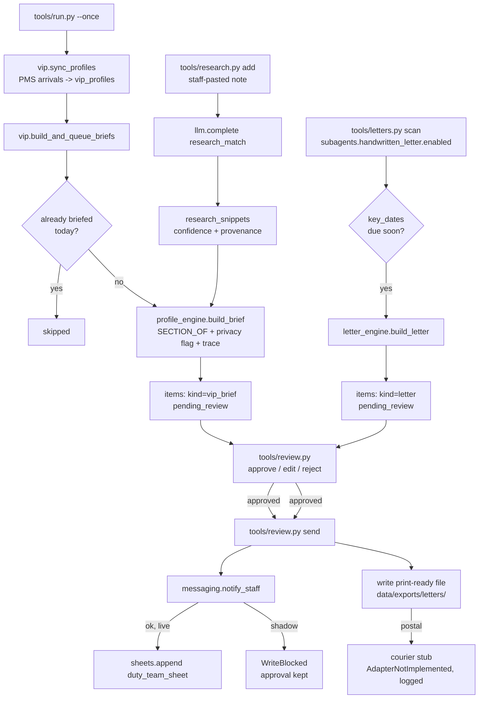

# How VIP AI works

VIP AI ("The Insider") has one always-on job — build and queue a VIP arrival
brief every morning — plus one optional sub-agent, Handwritten Letter AI
("The Scribe"), which turns a tracked key date into a letter draft. Both are
**deterministic**: rules, thresholds and templates decide, the way the demo
this repo is built from decided. The one LLM call in the whole repo helps a
human structure a research note they already found; it never decides who is
a VIP, what a brief says, or what a letter says.

## The loop

## What runs when

| Job | Cadence | Command | Provider calls |
|---|---|---|---|
| Sync profiles + build briefs | every morning | `tools/run.py --once` (`config/agent.yaml: schedule.main`) | none (deterministic) |
| Handwritten letter scan | every morning, after briefs | `tools/letters.py scan` (`schedule.letters_scan`) | none (deterministic); off by default |
| Research intake | on demand, whenever staff has something to log | `tools/research.py add` | one LLM call (`research_match`) |
| Review queue | whenever someone is free | `tools/review.py list/show/approve/edit/reject/send` | none |
| Coach | not applicable | — | VIP AI is not in `email-coach-ai.appliesTo` |

`make schedule ARGS="--all"` prints the exact snippet for every row above that
has a `schedule:` entry (research intake and the review queue are on-demand,
not scheduled). See README section 9.

## Modes and the review guard

`mode: shadow` (default) blocks every guarded write, approved or not. Two
writes are guarded in this repo:

- **`send_message`** (`messaging.notify_staff`) — the brief reaching the duty
  team. `sheets.append` (a follow-on export to the "housekeeping app" feed,
  `review_notify.duty_team_sheet`) runs only after that succeeds, so the two
  channels never disagree about whether a brief went out.
- **`publish`** — the letter dispatch step (writing the print-ready file to
  `data/exports/letters/`). There is no adapter call here to guard — see
  "What this repo does not build" below — so `tools/letters.py` calls
  `core.review.assert_write_allowed(settings, "publish", item)` directly,
  the same function every adapter's `@guarded_write` decorator calls.

Both follow the reference pattern: `WriteBlocked` in shadow mode leaves the
item at `approved` ("approval kept"), never `failed` — see
`tools/review.py:cmd_send`.

## Data model

Two tables of our own, added with `store.migrate()` (see `tools/vip.py:SCHEMA`),
alongside the shared `items` table every repo in this family has.

**`vip_profiles`** — the living memory. `guest_key` (email, else phone, else
lower-cased name) is the match key back to the PMS. `tier`, `visits`,
`room_type`, `arrival_date`/`arrival_offset` are refreshed by every
`vip.sync_profiles` pass; `preferences_json` and `key_dates_json` are seeded
once, from the reservation's own PMS fields, the first time a profile is
created, and **never touched by sync again** — from then on they are the
hotel's own memory, written only by `tools/vip.py capture` / `key-date` /
`do-not-contact`, so a later sync never overwrites what a human (or the
Front Desk AI, if you wire it in — see "Design decisions" below) taught the
profile. `history_note` mirrors the PMS guest's own notes field on every
sync (that one is genuinely the PMS's data, not this agent's memory).

**`research_snippets`** — one row per staff-logged research note:
`vip_id`, `source`, `headline`, `body`, `confidence`
(`confirmed`/`likely`/`unsure`), `reasoning`, `provenance` (always
`"public source — staff verified"` in this build, never a claim of an
automated scrape — see below).

**`items`** (shared, `core/store.py`) carries both queues:
`kind="vip_brief"` (payload = the profile snapshot + brief; draft = the
`VipBrief` dict) and `kind="letter"` (payload = occasion + delivery; draft =
`{subject, body}`). Both go through the same FSM and the same
`tools/review.py`.

## Idempotency

- **Briefs.** `unique_key = f"{profile_id}:{today}"` on the item — a second
  `tools/run.py --once` the same day is a no-op (`store.upsert_item` finds the
  row and `vip.build_and_queue_briefs` sees it already has a `draft` for
  today and skips it, never re-drafted and never faked as `auto_sent`).
  **This is deliberate, but it means research logged after the first pass
  never reaches that draft on its own** — `tools/research.py add` warns
  about exactly this when it detects it (decision 20). To pull it in, run
  `python3 tools/run.py --once --only briefs --rebuild`: it rebuilds the
  draft for any brief still `pending_review`/`needs_human` (an approved,
  edited or sent brief is never touched — a human decision is never
  overwritten).
- **Letters.** `unique_key = f"{profile_id}:{occasion_slug}:{year}"` — the
  same key date can never produce two letters.
- **Profile sync.** `vip_profiles.guest_key` is `UNIQUE`; `vip.sync_profiles`
  is a pure upsert on the factual fields only (see above), so running it
  every 30 minutes instead of once a day changes nothing except freshness.
- **`--dry-run`** computes and prints but calls `store.migrate()` /
  `list_items` only (reads); it never calls `upsert_item`, `transition` or
  `next_sequence`. Verified by `tests/test_vip_flow.py::test_dry_run_twice`.

## Design decisions (the spec was silent or the demo was incomplete)

Numbered against `specs/vip-ai.md` §11 and `specs/handwritten-letter-ai.md`
§11.

**1. The Scout does not scrape anything, and this repo does not build one.**
"Researches the guest from public sources (LinkedIn first, then Instagram and
press)" is the roster's headline promise, and the demo has no research code
at all — snippets are seeded rows. Building a live scraper here would mean
this template ships with the exact three problems the open question flags:
LinkedIn/Instagram ToS violations, no lawful basis for the resulting
personal-data processing, and no identity-matching logic to decide whose
profile a headline belongs to. Instead: **a human (or another tool you point
at this one) finds the public information themselves — the way any member of
staff already does before a VIP's stay — and pastes it into
`tools/research.py add`.** The one LLM call in this repo turns that raw paste
into a clean headline/body and flags low-confidence or guardrail-adjacent
content (see step 2). `docs/integrations.md` documents this as the recipe for
wiring in a real search tool later, honestly labelled as not built here.

**2. Match confidence is real, not decorative.** Every `research_snippets` row
carries `confidence` (`confirmed`/`likely`/`unsure`) from the `research_match`
LLM task, plus `needs_human` when confidence is `unsure` or the note reads as
inferring health, family or money from public facts (the guardrail text
verbatim: "nothing inferred about health, family or money"). An `unsure` or
flagged snippet is stored but excluded from `profile_engine.build_brief`'s
input until a human confirms it with `tools/research.py confirm <id>` — so
the brief's traceability guarantee ("nothing in this brief is invented") also
covers "nothing in this brief is a guess about who someone is."

**3. The profile grows through `tools/vip.py capture`, not automatically.**
Deciding *when* a stay should update a preference (a housekeeping note? a
front-desk observation? a guest's own email?) is a judgement call this repo
does not make for you — the spec says as much. What it does provide: a single
command any human or another agent (Front Desk AI, Housekeeping AI) can call
— `tools/vip.py capture <guest_key> --key drinks --value "..." --source
front-desk` — which updates the local profile immediately and also attempts
`pms.add_note()` so the note survives even if this agent is never run again.
The PMS write is best-effort and guarded like any other write (`pms_write`);
its failure never blocks the local capture. `vip.sync_profiles` seeds
`preferences`/`key_dates` **once**, from a reservation's own PMS fields, only
when a profile is first created (many PMSs already keep a custom-fields
preferences block) — every sync after that leaves them alone, and `capture` /
`key-date` are the only writers from then on.

**4. Daily generation is a real schedule, not explanatory copy.** In the demo,
`brief-daily` only changes a sentence of thinking-log text. Here,
`config/agent.yaml: schedule.main` really does run `tools/run.py --once`
every morning (default `0 6 * * *`), and `rules.brief_daily` is read by
`profile_engine.build_brief` only to decide the wording of one explanatory
line in the brief itself (matching the demo's own step 2 copy) — the schedule
is what makes the promise real, the flag is what makes the brief's own text
honest about whether that schedule is wired up.

**5. Distribution is `messaging.notify_staff` plus a sheets export**, not a
simulated toast. Pick one at setup: `messaging.adapter: unipile` for a WhatsApp
broadcast to the duty team, or `webhook` to relay into whatever your "morning
huddle" tool already is. The `sheets.append` follow-on
(`review_notify.duty_team_sheet`, default sheet name `vip_briefs`) is the
honest stand-in for "the housekeeping app" — export to a shared sheet your
housekeeping app can already read, rather than promising a direct integration
this repo does not have.

**6. Privacy detection stays a regex over free text in v1**, exactly as the
demo. Making it a structured flag with a lawful basis and a per-snippet
retention period is real work worth doing before this handles genuinely
sensitive guests — `tools/vip.py do-not-contact` is the blunt instrument this
repo ships instead (it suppresses letters outright; it does not suppress
briefs, since staff still need to know who is arriving). Flagged in
`docs/safety.md`.

**7. No link to a Compliance/GDPR agent exists.** `docs/safety.md`'s erasure
recipe ("delete every row whose payload mentions this guest") covers
`vip_profiles` and `research_snippets` by name so a human can act on a request
today; an automated hand-off to a Compliance AI is future work, not built
here.

**8. Unknown preference keys land in `front_office`**, unchanged from the
demo — `profile_engine.SECTION_OF` is a plain dict a hotel can extend in
`config/agent.yaml` rather than a taxonomy this repo tries to guess for you.

**9. `vip_first` still only changes brief wording, not a real queue.** No
other agent in this family reads VIP tier today, so there is no queue for a
VIP request to jump. The flag is kept because the brief's own text describes
what the hotel has promised the guest; wiring an actual priority queue into
Front Desk AI or Concierge AI is a cross-repo change out of scope here.

**10. Letters: the template no longer hard-codes "years" for a birthday or a
visit-count milestone.** `letter_engine.opening_line()` branches on the
occasion text — `anniversary` uses the years wording, `birthday` gets its own
opening, a visit-count milestone (`"100th stay"`) gets an ordinal opening —
instead of always forcing "This years." when no anniversary number is found.

**11. The flowers line is parameterised, not hard-coded to "your daughter's."**
It fires only when a `flowers_from` preference key is set (e.g. `"daughter"`,
`"the family"`) — no key, no flowers line, rather than guessing a relationship
that may be wrong.

**12. Delivery needs an address, and the repo says so.** A letter's `delivery`
is `in_house` (default — placed at turndown, no address needed) or `postal`
— because a mailing address is already on the profile, or because staff say
so ahead of one being on file (`capture <guest> --key delivery --value
postal`, decision 17). A postal letter with no address on file goes straight
to `needs_human` instead of silently building an undeliverable letter.

**13. No robot-handwriting service is called, anywhere in this build.** The
roster's "via a robotic-handwriting service" is real in production for
whichever pen-plotter vendor a hotel picks; there is no such vendor here.
`tools/letters.py dispatch` writes a plain-text, print-ready file to
`data/exports/letters/<item-id>.txt` and, for `postal` deliveries, calls the
`Courier` **stub** (`core.adapters.get_stub("courier", settings)`) — which
raises `AdapterNotImplemented`, caught and logged, never silently swallowed.
`docs/integrations.md` says exactly this.

**14. Duplicate suppression is the item's `unique_key`** (`profile_id` +
occasion + year) — one letter per key date per year, full stop.

**15. Every letter needs approval; there is no auto-queue threshold.** The
spec's "high-value relationships" language implies a threshold that is never
defined in the demo. This repo does not invent one: every letter, regardless
of tier or spend, goes `pending_review` and needs a human `approve`/`edit`
before `tools/review.py send` can even attempt to dispatch it — matching the
guardrail exactly rather than adding a config knob nobody asked for.

**16. `subagents.handwritten_letter.enabled` is the rule toggle** the demo's
Scribe never had — `docs/sub-agents.md` covers exactly what flips.

**17. `mailing_address` has exactly one writer: `tools/vip.py capture
<guest> --address ...`.** It is living memory, like `preferences_json` and
`history_note` (decision 3) — `sync` never touches it, because a sync only
ever refreshes the factual columns. Until a hotel runs `capture --address`
for a guest, every letter for them defaults to `in_house` delivery; a
`postal` key date with no address on file goes to `needs_human` instead of
building an undeliverable letter (decision 12).

With address-presence as the only signal, though, `postal` could never
exist *without* an address either, so "no address" could never actually be
missing — the guardrail would be unreachable by construction, not just
unused. `tools/letters.py::_delivery_for` also reads the ordinary
preference key `delivery` (`capture <guest> --key delivery --value
postal`) — set by staff who know a guest wants their letters mailed before
an address is on file — so `channel: postal, address: ""` is a real state
the guardrail actually has to handle, and does.

**18. The brief's "stay context" line is staff guidance, not a trace of the
rule engine that produced it.** `profile_engine.build_brief` still reads
`rules.brief_daily` / `rules.vip_first` to pick the wording, but the wording
itself never describes the agent's own internals ("this brief would have
generated by itself…") — it tells a duty manager two things in plain
sentences: whether this brief is part of the automatic daily run, and
whether this guest's requests get priority. Every line in `front_office`
still carries a `trace` back to the rule that produced it (`profile_engine`'s
own traceability guarantee), the *displayed text* just stopped reading like
a code comment.

**19. Letter visit counts are grammatical.** `letter_engine.visit_times_phrase`
says "one time", never "one times", and "N times" for everything else
(including "no times" for a first-time-tomorrow guest whose letter fires
early) — the demo's `"{word} times now"` never branched on 1.

**20. A research note logged after today's brief already exists does not
disappear silently.** `tools/research.py add` checks whether the guest's
brief for today exists and is still `pending_review`/`needs_human`, and if
so prints exactly what to run: `python3 tools/run.py --once --only briefs
--rebuild`. `--rebuild` re-runs `profile_engine.build_brief` for any brief
in that state (never one already approved, edited, or sent — see
`vip.UNAPPROVED_BRIEF_STATUSES`), so the fix is a documented command, not
"notice it and retype it with `review.py edit`."

## What this repo does not build

- **No LinkedIn/Instagram/press scraper.** See decision 1. `tools/research.py`
  is an intake tool for a human's own research, not an automated one.
- **No pen-plotter / handwriting-robot integration.** See decision 13.
- **No direct "housekeeping app" API.** `sheets.append` is the honest stand-in.
- **No Compliance/GDPR agent hand-off.** See decision 7.
